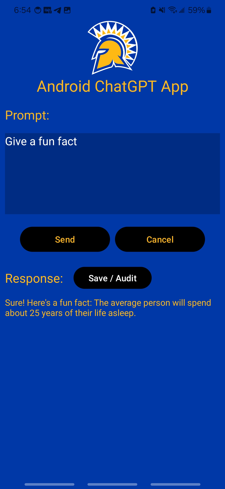

# CMPE277 - Android Chat GPT UI Audit Log Prompts and Responses
## Assignmet Learning Objective

Save Prompt and Responses on Phone for Audit Log purposes.

## Authors

- [@Harshil-V](https://github.com/Harshil-V/)
- [@Chandrasekar Vuppalapati](chandrasekar.vuppalapati@sjsu.edu)

## Notes

- At API Key will need to be saved to the “local.properties” file.

## Screenshots

  

    
  

  

    
  

  

    
  

  

    
  

   

    
  

  

    
  

  

    
  

  

    
  

  

    
  

  

    
  

